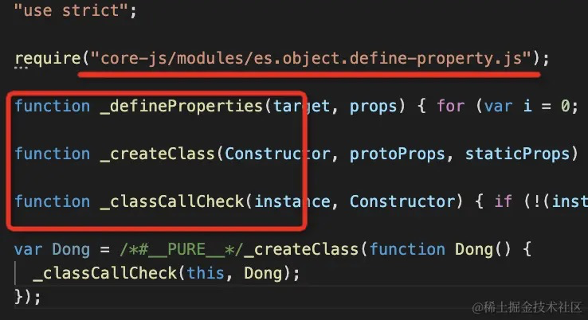
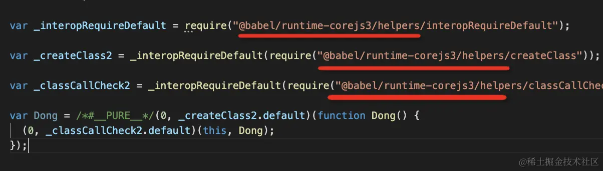

> 《[Babel 插件通关秘籍](https://juejin.cn/book/6946117847848321055/section)》

# Babel的用途

1. 把代码中的esnext的新语法、typescript和flow语法转成目标环境支持的js语法
2. 把目标环境不支持的api进行polyfill
3. Babel7提供了`@babel/preset-env`的包，可以指定env(environment环境)按需转换，产物更小。
   比如指定浏览器版本:`{ "browserslist": "> 0.25%, not dead" }`

babel最开始的名字叫6to5，主要是做es6到es5语法的转换和polyfill，后来在4.0时改名为babel。

但做的事情并没有变，依然是从高版本语法的api转换成低版本的语法并自动polyfill缺少的api。

## babe-cli 和 @babel/cli 区别

一个是7.0版本之前，一个是7.0版本之后
不能同时使用，只能选择其中一个
包括`babel-core`&`@babel/core`

# Babel的编译流程

## @babel/parser

第一步：解析(parse)，把源码转成抽象语法树（AST）

## @babel/traverse

第二步：转换(transform)，生成了AST，还要通过遍历AST理解代码结构，从而进行静态分析。

比如：

- linter工具`@babel/eslint-parser`：对代码规范进行检查
- api文档自动生成工具，可以提取源码中的注释然后生成文档
- type checker工具`@babel/types`
- 压缩混淆工具 —— 分析代码结构进行删除dead code、变量名混淆、常量折叠
- js解释器——直接解释执行AST

## @babel/generator

第三步：生成(generate)，把AST打印成目标代码，并生成sourcemap

# AST

## ast可视化

AST可视化查看工具：https://astexplorer.net/

Babel查看编译结果：https://babeljs.io/repl

## ESTree标准

Q：为什么ESLint可以检查和修复格式问题，而Babel不可以❓
A：这两个工具的parser解析器不同，其次babel和eslint在开发流程中的职能不同，所以api设计结果也不同

最早是由esprima指定了estree标准，后来es标准更新太快跟不上，
后面基于`estree`标准出现了`acorn`，**支持通过插件拓展语法支持**

Babel就fork了acorn进行拓展并命名为`@babel/parser`：

- 拓展`Literal`为StringLiteral、BooleanLiteral等区分基础类型标识
- 拓展`Property`为ObjectProperty和ObjectMethod
- ...

ESLint也fork了acorn进行拓展并命名为`espree`：

- 为context提供`context.getSourceCode()`功能🚩
  可以定位到代码的前后，从而能结合上下文进行检查和修复

## 名词术语

- `range`
  节点的位置[node.start, node.end]
- `tokens`
  节点的标识：将所有已解析的标记(tokens)链式添加到当前token属性中


# babel-plugin-xxx

## visitor模式

> visitor模式的思想是：当被操作的对象结构比较稳定，而操作对象的逻辑经常变化的时候
> 通过分离逻辑和对象结构，使得他们能独立拓展

对应到babel traverse的实现，就是AST和visitor分离，在traverse（遍历）AST的时候，调用注册的visitor来对其进行处理。

```javascript
{
  "plugins": [
    "@babel/plugin-syntax-"
  ]
}
```

babel内置功能

- 乘方预算符`**`转换成`Math.pow`
- class转换成function
- ...


## 编写插件

### plugin-syntax-xxx

`syntax plugin`是在`parserOptions`中放入一个flag让parser知道要parse什么语法，最终的parse逻辑还是babel parser(babylon)实现的


### plugin-transform-xxx

`transform plugin`是对AST的转换，各种es20xx语言特性、typescript、jsx等的转换都是在transform plugin里面实现的

有的时候需要结合`syntax plugin`和`transform plugin`，比如ts的语法解析要使用
`@babel/plugin-syntax-typescript`在`parserOptions`放入解析ts语法的选项，
然后使用`@babel/plugin-transform-typescript`来转换解析出的ts对应的AST的转换

平时一般使用`@babel/presert-typescript`，它对上面两个插件做了封装

### plugin-proposal-xxx

未加入语言标准的特性的AST转换插件叫`proposal plugin`，
其实它也是`transform plugin`，但是为了和标准特性区分，所以这样叫。

🚩**proposal阶段的语法**

babel要转换的不只是加入标准的特性，语言特性从提出到标准会有一个过程：

1. 阶段0 - Strawman：只是一个想法，可能用babel plugin 实现
2. 阶段1 - `Proposal`：值得继续的建议
3. 阶段2 - Draft：建立`spec`
4. 阶段3 - Candidate：完成spec并且在浏览器实现
5. 阶段4 - Finished：会加入到下一年的e s20xx spec

完成`proposal`特性的支持，有时同样需要综合`syntax plugin`和`proposal plugin`，
比如`function bind（::双冒号操作符）` 就需要同时使用`@babel/plugin-syntax-function-bind`和`@babel/plugin-proposal-function-bind`

```javascript
foo::bar
// 等同于
bar.bind(foo);
```


# babel-preset-xxx

> **preset就是对babel插件配置的一层封装**

plugin是单个转换功能的实现，当plugin比较多或者plugin的options比较多的时候会导致使用成本升高。
这时候封装成一个preset，用户可以通过preset来批量引入plugin并进行一些配置。

比如只是转换js的`es spec`和`proposal`的特性并不够，还有开发`jsx`、`typescript`、`flow`里也会用到es新特性
这些转换对应的plugin分别放在不同preset里：

```javascript
{
  "presets": [
    "@babel/preset-rect",
    "@babel/preset-typescript",
    "@babel/preset-flow",
    "@babel/preset-env" // es新特性plugin合集
  ]
}
```


## 编写配置

`@babel/core`的包提供了`createConfigItem`的api，用于创建配置项。

```javascript
const pluginA = createConfigItem('pluginA);
const presetB = createConfigItem('presetsB', { options: 'bbb'})

export default obj = {
      plugins: [ pluginA ],
      presets: [ presetB ]
  }
}
```

### @babel/helper-xxx

每个特性的实现用一个babel插件实现，当babel插件多了，自然会有一些共同的逻辑。
babel设计了插件之间共享逻辑的机制，就是helper。helper分为两种：

- **一种是注入到AST的运行时用的全局函数**

  ```javascript
  visitor: {
    CallExpression: function CallExpression(path){
      // 插件里直接调用this.addHelper，
      // 会在顶层作用域声明对应的helper
      // 然后返回对应的identifier
      if (path.get("callee").matchesPattern("Object.setPrototypeOf")) {
        path.node.callee = this.addHelper("default")
      }
    }
  }
  ```

  这种`"default"`一般也用不到，主要是babel内部用。我们要使用时可以从`@babel/runtime`包引入
  
- **一种是操作AST的工具函数，比如变量提升这种通用逻辑**`@babel/helper-hoist-variables`

  ```javascript
  const hoistVariables = require('@babel/helper-hoist-variables').default;
  
  cosnt plugin = function () {
      visitor: {
          VariableDeclaration(path) {
              // 拓展AST操作函数
              hoistVariables(path.parentPath, (id) => {
                  path.scope.parent.push({
                      id: path.scope.generateUidIdentifier(id.name)
                  });
                  return id;
              }, 'const' );
          }
      }
  }
  ```

  `hoistVariables`属于操作AST

### @babel/runtime-xxx

`babel runtime`里面放运行时加载的模块，会被打包工具直接打包到产物中，这样不用重复声明polyfill。
下面放着各种需要在runtime使用的函数，包括三部分：`core-js`、`helper`、`regenerator`

- `core-js`：这就是新的 api 的 polyfill，分为 2 和 3 两个版本，3 才实现了实例方法的polyfill
- `helper`：对corejs的部分函数进行抽象，比如`_typeof`、`_extends`等
- `regenerator`：自己没有实现的用第三方，比如facebook实现的`async`的runtime库`regenerator-runtime`

babel就是对上述进行整合。比如async/await这种特性的实现比较复杂，标准api的实现和跟进需要花精力，
所以babel直接用了社区的实现。

`@babel/runtime`内置helper案例：

```javascript
class Circle {}

// babel转换
var Circle = function Circle(){
  _classCallCheck(this, Circle)
}

function _classCallCheck(instance, Constructor){
  // ...
}

```

使用`@babel/plugin-transform-runtime`就能将上述转换后的代码简化成：

```javascript
var _classCallCheck = require("@babel/runtime/helpers/classCallCheck"); // 避免了重复声明

var Circle = function Circle(){
  _classCallCheck(this, Circle)
}
```


## babel处理plugin和preset顺序

1. 先应用plugin，再应用preset
2. plugin从前到后，preset从后到前

# @babel/cli

```shell
npx babel script.js --out-file script-compiled.js
```

使用babel-cli直接打包文件，本文全篇都是基于此工具进行打包
而非`webpack`的loader。

polyfill指定库`corejs@2/3`

# 实例：@babel/preset-env

```javascript
{
    presets: [
        ['@babel/preset-env', {
            targets: 'chrome 30', // 根据指定浏览器版本来引入对应的插件
            debug: true, 					// 可以打印出用了哪些插件
            useBuiltIns: 'usage', // 引入方式，用到时再引用helper。'entry'表示入口处全引用
            corejs: 3							// polyfill实现版本，一般都为3，2的话部分不支持
        }]
    ]
}
```

🚩**`@babel/preset-env`的处理方式是helper代码直接注入、regenerator、core-js代码全局引入**



这样就会导致多个模块重复注入同样的代码，包体积冗余和污染全局环境。

所以需要将runtime给transform掉，即将**注入runtime代码的helper类**改成**同过操作AST的函数helper类**

而`@babel/plugin-transform-runtime`插件就是为了解决上面的问题

# 实例：@babel/plugin-transform-runtime

> 解决让`@babel/preset-env`从辅助(helper)代码直接注入和core-js全局引入的方式
> 改成从`@babel.runtime-corejs3`中引入，以节省代码大小。

```javascript
{
    presets: [
        ['@babel/preset-env', {
            targets: 'chrome 30',
            debug: true,
          	// 使用runtime后不得设置useBuiltIns，否则此插件无法完全沙盒化环境
            // useBuiltIns: 'usage',
            corejs: 3
        }]
    ],
    plugins: [
        ['@babel/plugin-transform-runtime', {
            corejs: 3
        }]
    ]
}
```

core-js的api不再是**全局引入**，而是变成了**模块化引入**。
避免在多个文件的时候每个文件都注入一大段代码，造成重复。
❓目前打包都是单文件，而且也没有require()`api，难道只针对node生效还是代码被混淆了



原理：先插件plugins，后preset，就导致`@babel/plugin-transform-runtime`是在`@babel/preset-env`之前调用的，
提前做了api的转换，那到了`@babel/preset-env`就没什么可转了，也就实现了polyfill的抽取。

缺点：runtime不能像preset-env那样指定target的env，导致可能不需要polyfill的也被引入相关polyfill包，
目前能做的就是指定`corejs`版本`2`/`3`。

# 实例：babel-plugin-import

`Tree Shaking`的一种手动实现方式(cherry-picking)。

```javascript
visitor: {
  Program: {
    enter(path){
      path.traverse({
        ImportDeclaration(path) {
          // import { Button } from 'antd'
          // ⬇️ ⬇️ ⬇️
          // import Button from 'antd/lib/button'
          path.replaceWith()
        }
      })
    },
    exit(){
      
    }
  }
}
```

babel还可以做：

1. 自动埋点-函数插桩
2. 自动国际化
3. 注释 - 自动生成文档
   `path.getTypeAnnotation()`

具体多参考`@babel/types`的api

# babel-plugin-tester

## 插件的单元测试

`babel-plugin-tester`通过对比生产的代码来实现

可以通过对比输入输出的字符串，也可以对比文件，还可以对比快照

# SourceMap

generate是把AST打印成字符串，是一个从根节点递归打印的过程，
对不同的AST节点做不同的处理，在这个过程中把抽象语法树中省略掉的一些分隔符重新加回来。

generate在生成的时候嗨可以选择是否生成sourcemap。

## 调试代码时定位到源码❓

```html
//# sourceMappingURL=http://example.com/path/to/your/sourcemap.map
```

Chrome、firefox等浏览器支持在文件末尾加上一行注释，
这样使用浏览器调试工具或vscode调试时会自动加载sourcemap

## 线上报错定位到源码

开发时会使用sourcemap来调试，但是生产不会。

这种情况一般是单独上传到打点平台，比如sentry

## 生成sourcemap

## 消费sourcemap


# .babelc 配置文件

