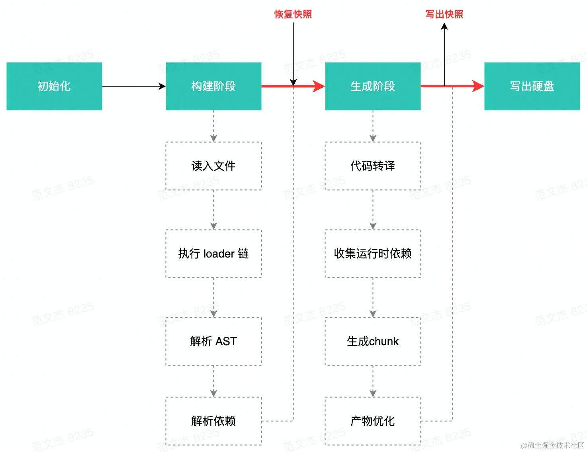

> 《[Webpack5 核心原理与应用实践](https://juejin.cn/book/7115598540721618944)》

# webpack和gulp区别

gulp、Grunt、RequireJS、Browserify等
或简单合并执行多种构建任务；
或聚焦于模块化方案的兼容处理；
或仅仅实现JavaScript层面的工程化（合并、压缩、混淆）能力。
缺乏一个能兼容所有不同类型文件的消息互通。

而Webpack则忽略具体资源类型之间的差异，将所有代码/非代码文件**统一看作Module**——
**模块对象**，以相同的加载、解析、依赖管理、优化、合并流程实现打包，
并借助**Loader、Plugin两种开放接口将资源差异处理逻辑转交由社区实现**，实现**统一资源构建模型**。

优点：

- 所有资源都是Module，所以可以用同一套代码实现诸多特性，包括：
  代码压缩、Host Module Replacement、缓存等；
- 打包时，资源与资源之间非常容易实现信息互换，例如：
  可以轻易在HTML插入Base64格式的图片；
- 借助Loader，Webpack几乎可以用任意方式处理任意类型的资源，例如：
  用Less、Stylus、Sass等预编译CSS代码。

# 为什么要学Webpack

每次遇到需要解决眼下具体问题时，翻阅资料和debug会耗费大量时间；

沉下心研读源码，才能理解内里的乾坤，通过调整配置自定义Loader/Plugin能迅速解决问题；

这种能力持续沉淀，就能逐渐成为我和其他同事非常重要的竞争力。

# webpack.config.js 配置项

> [Configuration](https://webpack.js.org/configuration/)

🚩webpack首先需要根据输入配置（`entry`/`context`）找到项目入口文件；

之后根据按模块处理（`module`/`resolve`/`externals`等）所配置的规则逐一处理模块文件，
处理过程包括转译、依赖分析等；

模块处理完毕后，最后根据后处理相关配置项（`optimization`/`target`等）合并模块资源、
注入运行时以来、优化产物结构等。🚩


## env 环境治理策略

- **开发环境**需要使用`webpack-dev-server`实现热更新;

- **测试环境**需要带上完整的`Sourcemap`，以帮助更新定位问题；

- **生产环境**需要尽可能打包出**更快、更小**、更好的应用代码，确保用户体验。

  ```bash
  // --config 选项指定配置目标
  npx webpack --config webpack.prod.js
  ```


## Analysis 性能分析工具

- **`profile: true`**
  webpack内置的[Stats Data](https://webpack.docschina.org/api/stats/)统计工具，在打包时可选择生成统计报告（webpack serve过程中不生成）

  ```bash
  npx webpack --profile --json=compilation-stats.json
  ```

- **Webpack Analysis** 
  stats.json在线可视化工具：https://webpack.github.io/analyse/

- **UnusedWebpackPlugin** <u>打包时</u>生成无用文件分析报告
  开发阶段使用`webpack-deadcode-plugin`可以在启动命令时输出


## HappyPack 并行构建

受限于Node.js的**单线程架构**，webpack所有操作都是在同一线程内串行执行，CPU利用率极低。

HappyPack能过将耗时的**文件加载（Loader）**操作拆散到多个子进程中并发执行，
子进程执行完毕后再将结果合并回传到Webpack进程，从而提升构建性能。
⚠️不过使用成本较高，需要把之前的loader序列改为`happypack/loader`

```diff
module: {
  rules: [
    {
      test: /\.js$/,
+      use: "happypack/loader?id=js",
-      use: [{
-        loader: 'babel-loader',
-        options: {
-          presets: ['@babel/preset-env']
-        }
-      }]
    }
  ]
}

plugins: [
+  new HappyPack({
+    id: 'js',
+    loaders: ['babel-loader?cacheDirectory'],
+    threads: 6,
+  }),
]
```


## Terser 并行压缩

Webpack4默认使用**`uglifyjs-webpack-plugin`**实现代码压缩，Webpack5之后则升级为**`terser-webpack-plugin`**。
Terser是在UglifyJS基础上增加了ES6语法支持，并重构代码解析、压缩算法，提高执行效率和压缩率。

```javascript
const TerserPlugin = require("terser-webpack-plugin");

module.exports = {
    optimization: {
        minimize: true,
        minimizer: [new TerserPlugin({
            parallel: 2 // 最大并行进程数为2
        })],
    },
};
```


# CommonJS模块打包

> 代码参考：[https://github.com/shfshanyue/node-examples/tree/master/engineering/webpack](https://github.com/shfshanyue/node-examples/tree/master/engineering/webpack)

打包前开发代码
```javascript
// sum.js
module.exports = (...args) => args.reduce((x, y) => x + y, 0);

// entry.js
const sum = require('./sum.js');
sum(3,8);
```
打包结果:

1. `**__webpack_modules__**`: 一个数组，存储了所有模块。
将入口模块解析为AST，根据AST深度优先搜索所有的模块，并构建出这个模块数组。
每个模块都由一个包裹函数`(module, module.exports, __webpack_require__)`对模块进行包裹构成
2. `**__webpack_require__(moduleId)**`: 手动实现加载一个模块。
对已加载过的模块进行缓存，对未加载过的模块，根据id定位到`__webpack_modules__`中的包裹函数，执行并返回`module.exports`，并缓存。
```javascript
var __webpack_modules__ = [
  (module) => {
    // 业务模块代码
    module.exports = (...args) => args.reduce((x, y) => x + y, 0);
  },
];

// The module cache
var __webpack_module_cache__ = {};

// The require function
function __webpack_require__(moduleId) {
  // Check if module is in cache
  var cachedModule = __webpack_module_cache__[moduleId];
  if (cachedModule !== undefined) {
    return cachedModule.exports;
  } // Create a new module (and put it into the cache)
  var module = (__webpack_module_cache__[moduleId] = {
    exports: {},
  }); // Execute the module function

  // 🌟利用包裹函数直接对参数进行赋值，确保module内部是通过module.exports来导出模块的
  __webpack_modules__[moduleId](module, module.exports, __webpack_require__); // Return the exports of the module

  return module.exports;
}

var __webpack_exports__ = {};

// This entry need to be wrapped in an IIFE because it need to be isolated against other modules in the chunk.
(() => {
  const sum = __webpack_require__(1);

  sum(3, 8);
})();

```
精简版本
```javascript
const __webpack_modules__ = [
  (module, require)=> {
    // 业务模块代码
    const a = require('./a') // 递归balabala
    
    module.exports = ...
  }
];

const __webpack_require__ = (id) => {
  const module = { exports: {} };
  const m = __webpack_modules__[id](module, __webpack_require__);
  return module.exports;
};

//entry.js
const xxx = __webpack_require__(0);
```
# ESModule模块打包
打包前开发代码
```javascript
// sum.js
export const sum = (...args) => args.reduce((x, y) => x + y, 0);
export default sum;

// entry.js
const sum = require('./sum.js');
sum(3,8);
```
精简版本
```javascript
const __webpack_modules__ = [
  (__unused_webpack_module, __webpack_exports__,__webpack_require__)=> {
    
    __webpack_require__.r(__webpack_exports__);
    // esmodule 改为 commonjs 数据结构
    __webpack_require__.d(__webpack_exports__, {
      "default": () => (__WEBPACK_DEFAULT_EXPORT__), // export default
      "sum": () => (sum) // export ModuleName
    });
    
    // 业务模块代码
    // export ModuleName
    const sum = ...;
    // export default
    const __WEBPACK_DEFAULT_EXPORT__ = (sum);
  }
];

const __webpack_require__ = (id) => {
  const module = { exports: {} };
  const m = __webpack_modules__[id](module, __webpack_require__);
  return module.exports;
};

// ES6 module 对象标识占位
var __webpack_exports__ = {
  // 如果有ESM,则值被赋值为
  // __esModule: true,
  // Symbol(Symbol.toStringTag): "Module"
};

//entry.js
(()=>{
  __webpack_require__.r(__webpack_exports__);
  const xxx = __webpack_require__(0);
})

```
打包结果：

1. `__webpack_require__.d`
Object.defineProperty(exports, key, { enumerable: true, get: definition[key] });
2. `__webpack_require__.r`
Object.defineProperty(exports, '__esModule', { value: true });

# Tree Shaking

`Tree Shaking`是一个术语，通常用于描述移除JavaScript上下文中的未引用代码(`dead-code`)。
它依赖于ES Module语法`import`和`export`的静态结构特性，由`rollup`普及起来的。

🚩webpack是在**压缩阶段**移除dead-code的，所以要开启`optimization.minimize: true`才能生效。

## usedExports 标记死代码

**收集无用代码并标记，压缩工具借助该标记进行清除。**
`usedExports`依赖于[terser](https://github.com/terser/terser)（webpack5内置插件`terser-webpack-plugin`）去检测语句中的**“副作用”**。

```javascript
module.exports = {
  mode: "development",
  devtool: 'cheap-module-source-map',  // 想看到标记的无用代码，必须设值
  optimization: {
    usedExports: true,
    minimize: false, // 不压缩
  },
};
```

打包结果，无用代码会被标记`unused harmony export has`🚩，但是仍然会被保留。
后续通过压缩代码才能真正将无用代码删除。

```javascript
/******/ (() => { // webpackBootstrap
/******/ 	"use strict";
/******/ 	var __webpack_modules__ = ({

/***/ "./es_module.js":
/*!**********************!*\
  !*** ./es_module.js ***!
  \**********************/
/***/ ((__unused_webpack_module, __webpack_exports__, __webpack_require__) => {

/* harmony export */ __webpack_require__.d(__webpack_exports__, {
/* harmony export */   get: () => (/* binding */ get)
/* harmony export */ });
/* unused harmony export has */ ⬅️⬅️⬅️
// es_module get
const get = function () {
    console.log('get');
};

// es_module has
const has = function () {
    console.log('has');
};
  
  
/***/ })
```


## sideEffects 标记不要删

> “副作用”的定义是，在导入时会执行特殊行为的代码，而不是仅仅暴露一个export或多个export。
>
> 例如`polyfill`，它影响全局作用域但不提供export。
> 例如全局`css`，只要是被import的都会被检测。

```json
{
  "name": "package.json文件",
  "sideEffects": false
}
```

如果所有代码都不包含副作用，我们就可以在`package.json`中设置属性`sideEffects: false`。
但是对于存在副作用的也会被删除，所以我们需要告知webpack不要删除：

```javascript
// package.json
{
  "name": "package.json文件",
  "sideEffects": ["./src/polyfill-file.js", "./theme.css"]
}

// 也可以配置在webpack.config.js的module.rules中
{
  module: {
    // ...
    rules:[
      // ...
      {
        sideEffects: ["*.css"]
      }
    ]  
  }
}
```


## `__PURE__` 标记可以删

terser很难评估函数是否有副作用，比如包内存在`iife`、`闭包`或者export出的值是通过执行了某个函数而获得的(HOC)。
如下代码，即使不引用Button，但是`withAppProvider`也会自动执行，webpack不得不保留它。

只要在函数前标记`/*#__PURE__*/`（也可以写成`/*@__PURE__*/`）即可表示不被引用的话就是死代码，会被压缩工具清除。

```javascript
function withAppProvider(){
  return function(){}
}

const Button$1 = withAppProvider()(Button)
const Button$1 = /*#__PURE__*/withAppProvider()(Button) ⬅️⬅️⬅️

export {
	Button$1,
  Input,
  ...
}
```


## 代码压缩

JS的代码压缩原理

1. 将code转换成AST
2. 将AST进行优化，生成一个更小的AST
3. 将新生成的AST再转化成code

分号转逗号的规则

1. **表达式语句**分号会被转换为都好
2. **声明语句**分号不会被转换


## 原理：作用域分析

> 作用域分析：分析代码里面变量所属的作用域以及他们之间的引用关系，
> 有了这些信息，就可以推导出**导出变量**和**导入变量**之间的引用关系。
>
> 相关文章：**[《webpack如何通过作用域分析消除无用代码》](https://www.diverse.space/2018/05/better-tree-shaking-with-scope-analysis/)**
> 相关插件：`webpack-deep-scope-analysis-plugin`


使用**作用域分析**优化多层级的tree-shaking
webpack可以通过`entry`和`module`之间的调用得知对于一个`module`来说，哪些变量是会被使用到的`Input{Used:{scope1}}`


## 其他

1. **引入支持Tree Shaking的Package**
    使用**`lodash-es`**替代**`lodash`**

1. **`import *`**依然有效
`import * as _ from "lodash-es";`

3. **`export default all`是不明智的**
    对于ES6模块来说，会有**_default export_**和**_named export_**的区别。
    **_default export_**在概念上仅仅把一个名字叫default的export出来，
    像上述把一切东西都塞到default里面是一个错误的选择。

2. **`JSON TreeShaking`** json未用的字段也依然有效
`import obj from "./main.json";`

5. **webpack 4之前只支持ES模块的使用，不支持CommonJS、只分析浅层模块导出和引入关系**

6. **webpack 5增加了引入模块代码时的CommonJS风格的静态分析功能**
   即`const get = require('./es_module').get` ，引入时可以用cjs风格，
   但对应包的导出依然必须是es module风格

7. **新版的Babel-loader不会造成webpack的Tree-shaking失效，**

   [因为新版的不会将es转换成cjs了](https://www.bilibili.com/video/BV1oy4y1p7CC/?vd_source=7124316d1092457c652c2689962a24c1)

   ```javascript
   presets:[
     ["@babel/preset-env", { modules: "commonjs" }] // ⚠️如果主动改为cjs的话才会导致不生效
   ]
   ```

8. **`cherry-picking`（像采摘樱桃一样摘只要的那部分）**

   业务代码已经成型，没法大动全改为esm，或者包是cjs的，可以借助babel等工具修改引入方式

   - `babel-plugin-lodash`

   ```javascript
   import { sortBy } from "lodash"
   import sortBy from "loadsh-es/sortBy"
   ```

   还有其他类似的摇树功能：

   - `webpack-common-shake`
     删除无效代码 由UglifyJS（或其他优化程序）决定 

   ```javascript
    exports.used = 1;
    var tmp = exports.unused = 2;
    ↓ ↓ ↓ ↓ ↓ ↓
    exports.used = 1;
    var tmp = 2;
   ```

   - `ant-design/babel-plugin-import` 

   ```javascript
    import { Button } from 'antd';
    ↓ ↓ ↓ ↓ ↓ ↓
    var _button = require('antd/lib/button');
   ```


# Code Spliting代码切割
打包前开发代码
```javascript
import("./sum").then((m) => {
  m.default(3, 4);
});
```
精简版本：
```javascript
/* webpack/runtime/ensure chunk */
__webpack_require__.f = {};

// JSONP chunk
__webpack_require__.f.j = (chunkId, promises) => {
  __webpack_require__.l(url, loadingEnded, "chunk-" + chunkId, chunkId);
}

// 动态加载script并监听onload
__webpack_require__.l = ()=> {
  script.onload
  document.head.appendChild(script)
}

__webpack_require__.e = (chunkId) => {
  return Promise.all(Object.keys(__webpack_require__.f).reduce((promises, key/*! .j */) => {
    __webpack_require__.f[key](chunkId, promises);
    return promises;
  }, []));
};

// jsonp回调
var chunkLoadingGlobal = self["webpackChunkyour_project"] = self["webpackChunkyour_project"] || [];
chunkLoadingGlobal.forEach(webpackJsonpCallback.bind(null, 0));
chunkLoadingGlobal.push = webpackJsonpCallback.bind(null, chunkLoadingGlobal.push.bind(chunkLoadingGlobal));

// 业务代码
__webpack_require__.e(/*! import()  */ 1)
  .then(__webpack_require__.bind(__webpack_require__, /*! ./A 自定义的module */ 2))
  .then(res=>{
    console.log(res)
  })
  
})();
```
async.js:
```javascript
(self["webpackChunkyour_project"] = self["webpackChunkyour_project"] || [])
// 这里push就会执行webpackJsonpCallback动作
  .push([[1],{
  [moduleId]: 
  (module, require)=> {
    // 业务模块代码
    const a = require('./a') // 递归balabala
    
    module.exports = ...
  }
}])
```
打包结果：

1. `__webpack_require__.e`: 异步加载 chunk。该函数将使用 `document.createElement('script')` 异步加载 chunk 并封装为 `Promise`。
2. `self["webpackChunk"].push`: JSONP cllaback，收集 modules 至 `__webpack_modules__`，并将 `__webpack_require__.e` 的 Promise 进行 resolve。
# HMR热更新
也称**热模块替换，借助**`**webpack-dev-server**`**实现**
**实现过程：**

1. 用`**memfs**`模拟node.js`**fs**`API将打包输出bundle使用内存型文件系统控制，而非真实的文件系统。
2. 用`**chokidar**`监听文件变更，告诉webpack重新编译被修改的`**module**`
3. 用`**ws**`通知浏览器，浏览器接收到hash，以JSONP的方式请求更新模块的chunk
4. 🚩🚩**核心思想**🚩🚩：runtime.js内相关代码实现替换`__webpack_modules__`内指定id的模块
粒度是module chunk，runtime.hash.js不重新请求，只变更hash
```javascript
// webpack 运行时代码
const __webpack_modules__ = [
  (module, exports, __webpack_require__) => {
    __webpack_require__(0);
  },
  ...
  // id为7
  () => {
    console.log("这是一号模块");
  },
];

// HMR Chunk 代码
// JSONP 异步加载的所需要更新的 modules，并在 __webpack_modules__ 中进行替换
self["webpackHotUpdate"](0, {
  7: () => {
    console.log("这是最新的一号模块");
  },
});
```


# Module Federation 模块联邦

- 应用可按需导出，这些模块最终会被打包成模块包，类似npm模块；
- 应用可在运行时基于HTTP(S)协议动态加载其他应用暴露的模块，
  且用法与动态加载普通NPM模块`import()`一样简单；
- 与其他微前端方案不同，MF的应用之间关系平等，没有主应用/子应用之分，
  每个应用都能导出/导入任意模块；

## 远程（输出方）

`exposes`曝光指定模块文件

```javascript
const { ModuleFederationPlugin } = require("webpack").container;

plugin: {
  new ModuleFederationPlugin({
    name: "app1",		// 定义import一级模块名称
    fileName: "remoteEntry.js", // 生成打包文件的名称
    exposes: {
      "./utils": "./src/utils" // 定义二级模块名称
    }
  })
}
```

## 主机（引用方）

`remotes` + `await import()`加载http模块

```javascript
// webpack.config.js
plugin: {
  new ModuleFederationPlugin({
    remotes: {
      // key还可以再自定义一级模块名称
      app1: "app1@http://localhost:8081/dist/remoteEntry.js", // 生产模式改为cdn地址
    }
  })
}

// src/index.js
const { sayHello } = await import("app1/utils");
sayHello();
```

## 依赖共享（微前端架构）

`shared`依赖共享
两边都配置shared，就可以共享一个`vendors-node_modules_xxx.js`代码
前提是版本一致（可以通过`requiredVersion`设置区间版本，这样差小版本的话也可以共享）

```javascript
const deps = require("./package.json").dependencies;

// react微前端应用——路由模块联邦
new ModuleFederationPlugin({
  // 两边都要设置相同的shared
  shared: {
    react: {
      singleton: true, // 如果版本不满足就警告
      requiredVersion: deps.react,
    },
    "react-dom": {
      singleton: true,
      requiredVersion: deps["react-dom"],
    },
    "react-router-dom": {
      singleton: true,
      requiredVersion: deps["react-router-dom"],
    },
  },
}),
```

微前端的难点：

1. 多应用通信
   可以借助发布订阅模式+单例store，比如rxjs
2. MF实现的微前端架构并未提供沙箱能力，
   比如js/css未隔离

# Plugin

## SplitChunksPlugin（chunk分包）

> https://webpack.docschina.org/plugins/split-chunks-plugin/

Chunk 是 Webpack **模块分包**到最终输出打包产物过程中的策略设计代词，有3种类型的Chunk对象：

1. **`Initial Chunk`**：`entry`模块以及相应子模块在遍历构建(Make)阶段打包；
2. **`Async Chunk`**：遇到异步模块`import('./xx')`时，创建新的Chunk对象；
3. **`Runtime Chunk`**：**运行时**代码抽离成Runtime Chunk，可通过`entry.runtime`配置项实现。

Chunk分包结果的好坏直接影响最终应用性能（CPU：首屏渲染，IO：资源缓存粒度），仅依靠上面3个策略会有以下问题：

1. **模块重复打包**
   多个Chunk同时依赖同一个Module，那么这个Module会被不受限制地重复打包进这些Chunk
2. **资源冗余 & 低效缓存**
   `entry`通常只会设置1个，导致资源冗余
   业务代码频繁变动而第三方库资源(`node_modules`依赖)变动较少无法区分，导致低效缓存

为此，Webpack4开始内置`SplitChunksPlugin`（Webpack3使用`CommonsChunkPlugin`）插件实现灵活可配置的分包。
配置项：`optimization.splitChunks`

```javascript
module.exports = {
  //...
  optimization: {
    splitChunks: {
      // 作用范围
      chunks: 'async'(默认) | 'initial' | 'all'(建议),
      // Module被Chunk引用的次数决定是否分包
      minChunks: 1(默认),

      // 分包数量
      maxInitialRequest: 30, // 设置Initial Chunk最大并行请求数
      maxAsyncRequest: 30, // Async Chunk最大并行请求数
      
      // 分包体积
      minSize: 2000(bytes,默认20kb), // 限制chunk最小尺寸，避免分包过多
      maxSize: 0, // 会同时生效于 maxAsyncSize 和 maxInitialSize
      
      // vendor缓存组（不常更新）🚩
      cacheGroups: {
        // 将所有node_modules中的资源单独打包到`vendors-node_modules_xx.js`
        defaultVendors: {
          idHint: "vendors", // 文件名前缀
          reuseExistingChunk: true,
          test: /[\\/]node_modules[\\/]/i,
          priority: -10
        },
        // 引用次数大于等于2的模块单独打包`common-xx.js`
        default: {
          idHint: "common",
          chunks: "all",
          minChunks: 1,
          minSize: 1,
          reuseExistingChunk: true,
        },
      }
    },
  },
}
```

Q`minChunk`：**如何理解“被Chunk引用次数”？**🚩
A：不直接等价于被`import`的次数，而是取决于上游调用者是否被视作Initial Chunk或Async Chunk处理
      如被entry1的Initial Chunk引用、entry2的Initail Chunk引用、entry1内的异步模块Async Chunk引用，这就等于被引用了3次

Q`maxInitialRequest`：**如何理解“并行请求数”？**🚩
A：单此请求需要加载的Chunk分包数量，打包时会计算如果超过则会限制**体积较小的包**分出来，优先级高于`minChunk`
      完整的优先级：`minChunk`<`maxInitialRequest` < `maxSize` < `minSize`

其他`cacheGroups`：常用策略一是单独打包`node_modules`代码（习惯称为`vendor`），二是单独打包被频繁使用的模块（习惯称为`common`）

# Loader

> https://webpack.docschina.org/loaders/

## style-loader 样式

- `css-loader`让webpack识别`.css`文件
  改loader会将CSS等价翻译为形如`module.exports = "${css}"`的JavaScript代码，
  使得Webpack能够如同处理JS代码一样解析CSS内容与依赖资源

- `style-loader` runtime代码注入（**运行时使用js生成style代码**）🚩，根据`injectType`决定styles插入到DOM中的方式

  ```javascript
  module.exports = {
    module: {
      rules: [
        {
          test: /\.css$/i,
          use: ["style-loader", "css-loader"], // 根据loader倒叙执行顺序，style-loader在前
          // test: /\.less$/i,
          // use: ["style-loader", "css-loader", "less-loader"] // 有预处理器的写在最后
        },
      ],
    },
  };
  ```

  上述配置语义上相当于`style-loader(css-loader(.css))`链式调用，执行后样式代码：

  ```javascript
  // Part1: css-loader 处理结果，对标到原始 CSS 代码
  const __WEBPACK_DEFAULT_EXPORT__ = (
  "body {\n    background: yellow;\n    font-weight: bold;\n}"
  );
  // Part2: style-loader 处理结果，将 CSS 代码注入到 `style` 标签
  const injectStylesIntoStyleTag = require("./node_modules/style-loader/dist/runtime/injectStylesIntoStyleTag.js");
  injectStylesIntoStyleTag(
   __WEBPACK_DEFAULT_EXPORT__
  )
  ```

  

- `mini-css-extract-plugin` 
  构建期间生成CSS文件，并借助html-webpack-plugin将文件通过`<link>`标签方式插入到页面中。
  优点：

  1. JS、CSS资源分离，实现<u>**并行加载**</u>，提高页面性能； 
  2. <u>**资源缓存粒度降低**</u>，变更CSS（或内容膨胀）不影响生成的JS打包产物

  缺点：

  1. 不支持热更新🚩
     建议`production`模式时才使用
     `development`模式时使用`style-loader`以支持热更新

  ```javascript
  const MiniCssExtractPlugin = require('mini-css-extract-plugin');
  const HtmlWebpackPlugin = require('html-webpack-plugin');
  
  module.exports = {
    module: {
      rules: [
        {
          test: /\.css$/i,
          use: [
            (process.env.NODE_ENV === 'development' ?
               'style-loader' : // 开发阶段使用style-loader，支持hmr
               MiniCssExtractPlugin.loader // ⚠️不要和style-loader同时使用
            ),
            "css-loader"
          ],
        },
      ],
    },
    plugins: [
      new MiniCssExtractPlugin({
        filename: '[name].[contenthash].css',
      }),
      new HtmlWebpackPlugin(), // 必须同时使用hwp才能将产物以 link 标签方式插入到html中
    ]
  };
  ```

## PostCSS

PostCSS既不是后处理器也不是预处理器，不像Less/Sass/Stylus那样定义一套超集语言，
**而是与`@babel/core`类型，实现一套将CSS源码解析为AST结构，并开发API支持编写插件来进行分析和修改，**
丰富原生CSS、支持低版本编译、支持代码压缩等。

> 预处理器之于CSS，就像 TypeScript 与JavaScript的关系；
> 而 PostCSS 之于CSS，则更像 Babel 与JavaScript。

流行的PostCSS插件

```javascript
module.exports = {
  module: {
    rules: [
      {
        test: /\.css$/,
        use: [
          "style-loader", 
          "css-loader",
          {
            loader: "postcss-loader",
            options: {
              postcssOptions: {
               plugins: [
                 require("autoprefixer"), // 自动添加浏览器前缀
                 require("cssnano"), // 压缩css
                 
                 // 预设环境集合，包含了autoprefixer
                 require("postcss-preset-env")({ stage: 1 })
               ],
              },
            },
          }
        ],
      },
    ],
  }
};
```

- `postcss-import` 允许将CSS文件导入其他文件

  ```css
  @import './theme.css'
  ```

- `autoprefixer` 自动添加浏览器前缀
  通过package.json的browserslist配置定位需要兼容的浏览器

  ```css
  // 之前
  ::placeholder {}
  
  // 之后
  ::-moz-placeholder {
    
  }
  :-ms-input-placeholder {
    
  }
  ::placeholder {
    
  }
  
  ```

  

## file-loader 图像加载原理

在Webpack中，图像以及其他多媒体资源都被提升为一等公民——只能通过`import`/`requre()`导入模块的方式引用。
所以需要使用loader进行模块转换成html能理解的代码。由于这类loader使用频率非常高，在webpack5中直接内置

```diff
+ import url from '@assets/avatar.png'

- 

+  https://webpack.docschina.org/configuration/cache/

**首次构建时缓存**webpack生成的`Module`/`ModuleGraph`/`Chunk`模块，来改善构建速度。

🚩webpack5已内置`cache`配置项，比`cache-loader`缓存粒度更小

```javascript
module.exports = {
  cache: {
    type: 'filesystem',
    
    // 缓存文件路径
    cacheDirectory: '默认为 node_modules/.cache/webpack',
    
    // 当这些文件内容发生变化时，缓存会完全失效而执行完整的编译构建
    buildDependencies: {
      config: [
        // 通常可设置为各种配置文件
        path.join(__dirname, 'webpack.dll_config.js'),
        path.join(__dirname, '.babelrc')
      ],
    }
  },
  
  // memory模式，生产模式中被禁用，常用于开发模式
  cache: {type: 'memory'},
  cache: true, // 同上
}
```

webpack4之前版本需要使用社区维护的`cache-loader`

- 只缓存**Loader**执行结果，所以要写在所有loader之前
- 其他组件自带的缓存能力，如`babel-loader`、`eslint-webpack-plugin`(官方不推荐用eslint-loader了)、`stylelint-webpack-plugin`

```javascript
// webpack4
module: {
  rules: [{
    test: /\.js$/,
    use: ['cache-loader', 'babel-loader', 'eslint-loader'],
    // babel-loader自带有缓存能力
    // use:['babel-loader?cacheDirectory=true']
  }],
}
```

`hard-source-webpack-plugin`也是一种实现缓存功能的第三方插件。与`cache-loader`不同的是，
它不仅仅缓存了Loader运行结果，还保存了Webpack构建过程中许多中间数据，包括：
模块(Module)、模块关系(ModuleGraph)、模块Resolve结果、Chunks、Assets等，效果几乎和Webpack5自带的`cache`对齐。

```javascript
const HardSourceWebpackPlugin = require("hard-source-webpack-plugin");

module.exports = {
  // ...
  plugins: [
    new HardSourceWebpackPlugin(),
  ],
};
```

### 原理



1. 初始化：根据配置信息设置内置的各类插件
2. Make - 构建阶段，从`entry`模块开始，执行：
   - 读入文件内容；
   - 调用Loader转译文件内容；
   - 调用acorn生成AST结构；
   - 分析AST，确定模块依赖列表；
   - 遍历模块依赖列表，对每一个依赖模块重新执行上述流程，直到生成完整的模块依赖图
     —— `ModuleGraph`对象
3. Seal - 生成阶段，过程：
   - 遍历ModuleGraph，对每一个模块执行：
     - 代码转移，如`import`转换为`require`调用；
     - 分析运行时依赖
   - 合并模块代码与运行时代码，生成`chunk`;
   - 执行产物优化操作，如`Tree-shaking`；
   - 将最终结果写出到产物文件。

过程中存在许多CPU密集型操作，例如调用Loader链加载文件时，遇到babel-loader、ts-loader等工具时可能需要重复生成AST；
分析模块依赖则需要遍历AST，执行大量运算。

假设业务项目中有1000个文件，则每次执行`npx webpack`命令时，都需要从0开始执行1000次构建、生成逻辑。

缓存功能则将构建结果保存在文件系统中，在下次编译时对比每一个文件的内容哈希或时间戳，未发生变化的文件跳过编译操作，直接使用缓存副本，减少重复计算。
发生变更的模块则重新执行编译结果。

### 缺点

> https://github.com/webpack/changelog-v5/blob/master/guides/persistent-caching.md

Webpack始终将安全性置于性能之上，所以默认设置为`cache: false`，原因是某些操作下会使缓存失效：

- 升级loder或plugin依赖版本时
- 更改webpack.config.js/.babelrc等配置文件时
- 更改script命令参数时

🚩所以需要增加`buildDependencies`配置项主动告知某些操作下需要重新构建缓存

为缓存设置版本`cache.version`或名字`cache.name`也可以触发更新缓存

```javascript
module.exports = {
  cache: {
    version: `${process.env.GIT_REV}`,
    name: `${process.env.target}` // 命令行参数 --env.target mobile|desktop
  }
}
```


