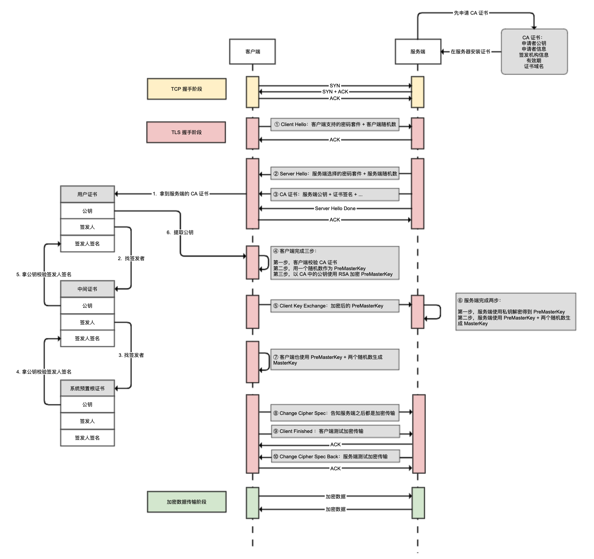

# 接口

1.  领域接口（原子接口）
即按领域、业务模块划分，需要前端多次访问，聚合逻辑 
2.  聚合接口（外观接口）
即后端根据页面把这些模块按一定逻辑聚合到一起，前端少量几次请求即可 
3.  问题：聚合逻辑应该谁来做？ 

根据业务场景划分（永远离不开业务场景），如果全都后端来做聚合，有些原子接口不能并行，必须有一定顺序请求，那么聚合过程会很慢

3.1. 根据 页面渲染优先级 给定领域接口
3.2. 根据接口是 否可缓存 来分析
3.3. 可缓存接口中再根据 可定时缓存、 访问换成 分析

4.  BFF架构（Backends For Frontends）
添加【API层】也叫【胶水层】专门做聚合 
5.  总结：合理的拆分和搭配，一切以业务优先 

## RESTful

Representational state transfer

是一种约定，参考google的[API设计指南](https://cloud.google.com/apis/design)

## 后台微服务 microservice

【胶水层】的一种实现，微服务通过API Gateway提供RESTful接口
优点是：

1. 具有业务的独立性和完整性，减少服务间的依赖
2. 微服务可以独立部署，便于负载管理和优化

## GraphQL

聚合可以用GraphQL来实现更轻松一些

GraphQL是一种针对Graph（图状数据）进行查询特别有优势的Query Language(查询语言)，所以叫做GraphQL。
它跟SQL的关系是共用QL后缀，就好像「汉语」和「英语」共用后缀一样，但他们本质上是不同的语言。

一个超级复杂的树状结构 可能需要多个类型的领域接口去获取，而且这些请求中还存在依赖关系，不能平行地发多个请求

为了解决这个问题，一个简单粗暴的办法是专门写一个RESTful API来聚合上述过程。但是很快新问题就会出现，随着业务迭代后面又要加一个类型的领域接口数据，那么RESTful API的实现也要跟着改。

GraphQL 能够很好地解决这个问题，但前提是数据已经以图的数据结构进行保存。

相关元素：
顶点类型、边类型

作者：Cat Chen 链接：[https://www.zhihu.com/question/264629587/answer/949588861](https://www.zhihu.com/question/264629587/answer/949588861) 

# Node.js应用场景

> 概念

1. **直出
**在前后端接口分离（前后端解偶）情况下，客户端访问页面时，从服务器拉去接口数据，并将数据嵌入页面，称为直出；
如果返回的是数据和模版，在前端渲染，称为【数据直出】；
如果后端根据数据渲染出页面，直接返回页面，【页面直出】
2. **前后端分离
**在服务器（JAVA/PHP）与浏览器（JS）的中间架一个Node的中间层
Node中间层提供直出，接口转发，静态资源等，属于前端范畴，由前端维护

特点：
1. MVC模型中，由前端接管VC，后端专注M
2. 解决性能问题：前端可以根据业务场景使用服务端直出和接口聚合等技术，减少客户端白屏时间
3. 将前端公用业务和逻辑后移，减少多端的重复开发

> 实战案例

1. [**百度地图瓦片直出**](https://www.cnblogs.com/well1010/articles/baidu-map-node-canvas.html)** **
有些端是渲染canvas的，有些端是渲染图片的
这时就可以用node来实现跨段抹平——将canvas数据渲染成图片直出

# 业务场景
## Webview鉴权流程(一次性短链)

1. 平台：访问链接通过【构造接口】+登陆态 构造一个一次性链接（或短链）
2. 一次性链接：是指定到h5一个专门处理短链的页面（也可以是后端301来做）
3. 处理链接页面：再通过【还原接口】转换成真实链接+登陆态，并重定向

## 静态资源的缓存标头应该怎么写?

> 网站的静态资源，通常不会经常变动，它们的缓存应该怎么写 HTTP 标头呢。
> https://www.macarthur.me/posts/more-aggressive-cache-headers

# HTTP

## 网络编程、IP、端口号

**网络编程**：
把分布在不同地理区域的计算机与专门的外部设备用通信线路连成一个规模大、功能强的网络系统
从而使众多的计算机可以方便地互相传递信息、共享硬件、软件、数据信息资源等。
**设备之间在网络中进行数据的传输，发送/接收数据。**

**IP地址**：
用来标志网络中的一个通信实体的地址。通信实体可以是计算机，路由器等。

**端口号**：
IP地址用来标志一台计算机，但是一台计算机上可能提供多种应用程序，使用端口来区分这些应用程序。

## Socket套接字

应用层 <-> 套接字Scoket <-> 传输层（TCP或UDP）

Socket就是应用层与传输层之间的桥梁。(读取阶段)

## 网络通信协议（TCP分层协议）

计算机网络中实现通信必须有一些约定，即**通信协议、对速率、传输代码、代码结构、传输控制步骤、出错控制**等制定标准。

由于结点间联系复杂，制定协议时，把复杂成份分解成一些简单的成份，再将它们复合起来。
最常用的复合方式是层次方式，即同层间可以通信、上一层可以调用下一层，而与再下一层不发生关系。

**TCP/IP协议分层**
应用层（程序员接触的）
传输层（UDP、TCP）
网络层（IP）
物理层（数据链路层）

名义上的标准：ISO/OSI参考模型
应用层：程序实现需求
表示层：解决不同系统之间的通信问题，比如Linux给windows发包
会话层：自动发包，自动寻址功能
传输层：当传输的内容过大时，对发出去的数据进行封装
网络层：传输过程中选择最优路径（就是路由器、交换器那些具有寻址功能的设备所实现的功能）
数据链路层：确保数据传输正确，提供检测和纠错功能
物理层：定义物理设备的标准（网线的接口类型、光纤的接口类型、各种传输介质的传输速率、变成010101从物理设备中传输出去）

## 超时

对于HTTP调用，虽然应用层走的是HTTP协议，但网络层面始终是TCP/IP协议。
TCP/IP是面向连接的协议，在传输数据之前需要建立连接，提供2个超时参数：

**连接超时参数 ConnectTimeout ，让用户配置建连阶段的最长等待时间；**（三次握手本身非常短，超时可能是防火墙或网络问题，所以一般设置1～5秒。纯内网调用还可以更短，在下游服务离线无法连接时可以快速失败）

通常，**服务会有多个节点，**
如果通过客户端内置的负载均衡技术（也就是直连接服务端），超时大概率是服务端的问题；
如果服务端通过Nginx的反向代理来负载均衡，客户端连接的其实是Nginx，而不是服务器，超时应该排查Nginx。

**读取超时参数 ReadTimeout，用来控制从Socket上读取数据的最长等待时间。**
向Socket写入数据后，我们等到Socket返回数据的超时时间，其中包含的时间是服务端处理业务逻辑的时间。
读取超时，不意味着服务端的执行就会中断。

**不是超时时间越长，成功率越高**
对于定时任务或异步任务来说，读取超时配置长些。
面向用户响应的请求或者微服务短平快的同步接口调用（GET），并发量较大，应当设置较短的读取超时时间（小于30秒），避免拖垮并发线程。

## 重试

超时后怎么办？利用Ribbon自动重试机制重新请求。
有时重试机制会脱离预期，怎么解决？

1. HTTP协议规范设计是接口从GET改为POST
   （GET请求是数据查询操作，是无状态的，考虑会丢包Ribbon/Nginx都实现了GET会自动重试，需要手动关闭重试）
2. 接口幂等性设计

## 并发

以爬虫的抓取能力为例

爬虫服务端，使用**高上限的线程池**来做爬取任务，有钱的可以堆机器做分布式。
被爬虫服务端，配置并发数（升级HTTP协议到最新）maxPerRoute=50

# 如何保存用户密码？

1. **MD5加密后保存**
   MD5是散列、哈希算法或者摘要算法，MD5加密后得到的都是有固定长度摘要信息或指纹信息，单向的。
2. **MD5加盐呢？**
   想象一下，黑客构建一个超大的数据库，把20位以内的数字和字母组合的密码库全部计算一遍就能破解。
   简称字典表或彩虹表
3. **用随机盐，比如UUID，然后随存在用户表中呢？**
   是一个好办法，就是用户每次修改密码，也要重新修改盐。盐的唯一性防止黑客生成的彩虹表能复用，也就减少了黑客的动力。
4. **用BCrypt哈希，专为保存密码设计的算法**
   就是耗时。

## 如何保存姓名和身份证（二要素）？

1. **AES对称加密**（使用相同的密钥进行加密和解密），优点是速度快，缺点是有密钥泄漏风险。
2. **DES非对称加密**（使用公钥加密，使用私钥解密），缺点是速度慢，优点是密钥配送分发安全。

## HTTPS 加密

1. **机密性**（使用非对称加密）

2. **完整性**（使用散列算法对信息进行摘要，确保信息完整无法被中间人篡改）

3. **权威性**（使用数字证书，来确保我们是在合法的服务端通信）

   > 从服务端拿到的CA证书是用户证书，我们需要通过证书中的签发人信息找到上级中间证书，再往上找到根证书。
   > 根证书只有为数不多的权威机构才能生成，一般预置在OS中，根本无法伪造

### 在TCP握手期间加解密

建立 HTTPS 连接的过程，首先是 TCP 握手，然后是 TLS 握手的一系列工作，包括：

客户端告知服务端自己支持的密码套件（比如 TLS_RSA_WITH_AES_256_GCM_SHA384，其中 RSA 是密钥交换的方式，AES_256_GCM 是加密算法，SHA384 是消息验证摘要算法），提供客户端随机数。

**服务端**应答选择的密码套件，提供服务端随机数。

**服务端**发送CA证书给客户端，**客户端**验证CA证书。

**客户端**生成 PreMasterKey，并使用非对称加密 + 公钥加密 PreMasterKey。

**客户端**把加密后的 PreMasterKey 传给**服务端**。

**服务端**使用非对称加密 + 私钥解密得到 PreMasterKey，并使用 PreMasterKey+ 两个随机数，生成 MasterKey。

**客户端**也使用 PreMasterKey+ 两个随机数生成 MasterKey。

**客户端**告知服务端之后将进行加密传输。

**客户端**使用 MasterKey 配合对称加密算法，进行对称加密测试。

**服务端**也使用 MasterKey 配合对称加密算法，进行对称加密测试。

